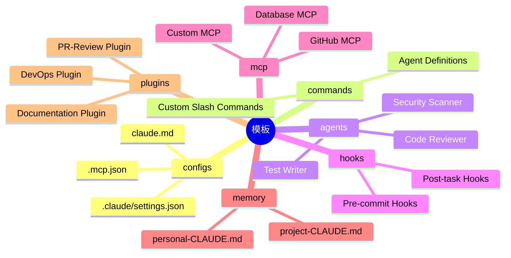
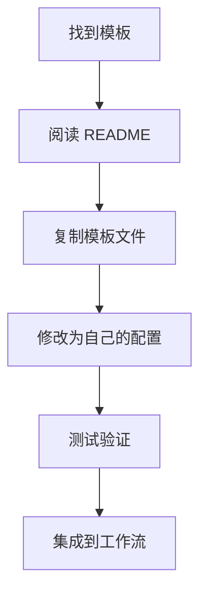
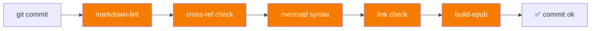
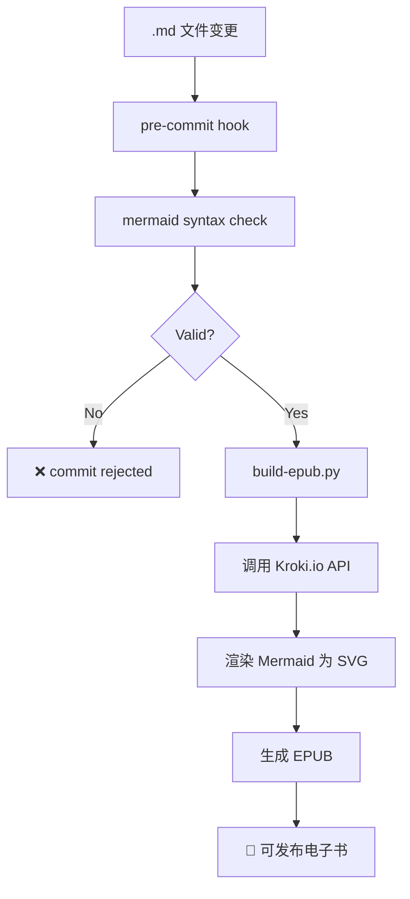

# Claude How To 设计理念

## 1. 核心理念

### 1.1 三大设计目标

Claude How To 不是功能手册，而是**实战驱动的视觉化教程**。核心设计目标：

| 目标 | 说明 | 实现方式 |
|------|------|----------|
| **拿来即用** | 不止描述功能，给出可直接复制到项目中的模板 | 47个模板覆盖配置、命令、Agent、Hook、MCP |
| **可视化学习** | 用 Mermaid 图表展示内部机制，理解"为什么"而非"是什么" | 每个模块含架构图、流程图、时序图 |
| **渐进式路径** | 从入门到精通有明确路线，不同学历者都能找到起点 | 10个编号模块 + 3级难度自测 + 个性化学习路径 |

### 1.2 解决的问题

- **官方文档描述功能但不展示如何组合** — Slash Commands + Hooks + Memory + Subagents 如何串联成自动化工作流？
- **没有清晰学习路径** — MCP 和 Hooks 谁先学？Skills 和 Subagents 何时用？
- **示例过于基础** — "hello world" 级别的命令模板无法用于生产

---

## 2. 渐进式模块设计

### 2.1 编号即课程

模块使用两位数字前缀（01-10），编号 = 推荐学习顺序，不可调换：


### 2.2 三层难度体系

| 层级 | 自测条件 | 目标模块 | 预计时间 |
|------|----------|----------|----------|
| **Level 1: Beginner** | 0-2个✓ | 01-02 (命令+记忆) | ~3小时 |
| **Level 2: Intermediate** | 3-5个✓ | 03-06 (技能+代理+MCP+钩子) | ~5小时 |
| **Level 3: Advanced** | 6-8个✓ | 07-10 (插件+检查点+高级+CLI) | ~5小时 |

---

## 3. 模板系统设计

### 3.1 七类模板

47个模板分为7大类，存放在对应模块目录下：



### 3.2 模板使用流程



---

## 4. 插件架构设计

### 4.1 三大生产级插件

| 插件 | 功能 | 命令 | Agent |
|------|------|------|-------|
| **DevOps Automation** | 部署、状态检查、Incident响应 | `/deploy` `/status` `/incident` `/rollback` | Deployment Specialist, Alert Analyzer, Incident Commander |
| **PR Review** | 安全检查、测试检查、性能分析 | `/review-pr` `/check-security` `/check-tests` | Security Reviewer, Test Checker, Performance Analyzer |
| **Documentation** | 文档同步、API生成、README生成 | `/sync-docs` `/validate-docs` `/generate-api-docs` `/generate-readme` | API Documenter, Code Commentator, Example Generator |

### 4.2 插件目录结构

```
07-plugins/
├── devops-automation/
│   ├── commands/          # deploy.md, status.md, incident.md, rollback.md
│   ├── agents/            # deployment-specialist.md, alert-analyzer.md, incident-commander.md
│   └── README.md
├── pr-review/
│   ├── commands/          # review-pr.md, check-security.md, check-tests.md
│   ├── agents/            # security-reviewer.md, test-checker.md, performance-analyzer.md
│   └── README.md
└── documentation/
    ├── commands/          # sync-docs.md, validate-docs.md, generate-api-docs.md, generate-readme.md
    ├── agents/            # api-documenter.md, code-commentator.md, example-generator.md
    ├── templates/         # adr-template.md, function-docs.md, api-endpoint.md
    └── README.md
```

---

## 5. 多语言国际化

### 5.1 翻译覆盖

| 语言 | 目录 | 状态 |
|------|------|------|
| English | 根目录 | 完整 |
| 越南文 | `vi/` | 完整 |
| 中文 | `zh/` | 完整 |
| 乌克兰文 | `uk/` | 完整 |
| 日文 | `ja/` | 完整 |

### 5.2 翻译管理

- 每个模块的 README.md 在根目录，翻译放在对应语言子目录
- Logo 使用 `<picture>` 标签支持暗色/亮色模式
- 图片资源通过 `resources/` 目录集中管理

---

## 6. 质量保障体系

### 6.1 五层预提交检查



### 6.2 检查工具栈

| 工具 | 用途 | 范围 |
|------|------|------|
| `ruff` | Python lint + format | `scripts/` 目录 |
| `bandit` | 安全扫描 | `scripts/` 目录 |
| `mypy` | 类型检查 | `scripts/` 目录 |
| `markdownlint` | Markdown 格式 | 所有 .md 文件 |
| `mermaid-cli` | Mermaid 语法验证 | 所有含图表的 .md |
| `link-check` | 死链检测 | 所有外部 URL |
| `cross-ref` | 交叉引用检查 | 内部链接完整性 |

---

## 7. 自动化构建

### 7.1 EPUB 生成流程



### 7.2 构建工具链

```yaml
Python 工具:
  - uv: 依赖管理 + 虚拟环境
  - ruff: lint + format
  - mypy: 类型检查
  - bandit: 安全扫描
  - pytest: 测试框架

文档工具:
  - Kroki.io: Mermaid → SVG/PNG 在线渲染
  - VitePress: Web 文档站构建（本设计站）
  - EPUB: 电子书生成
```

---

## 8. 设计原则总结

| 原则 | 实施 |
|------|------|
| **渐进性** | 编号模块 + 三级难度 + 个性化路径 |
| **实用性** | 47个模板 + 3大插件 + 可视化流程图 |
| **一致性** | STYLE_GUIDE.md 规范所有格式、命名、提交风格 |
| **可验证** | 5层预提交检查 + 自动化 EPUB 构建 |
| **国际化** | 5种语言完整覆盖 |
| **可扩展** | 插件架构支持自定义命令、Agent、模板 |
